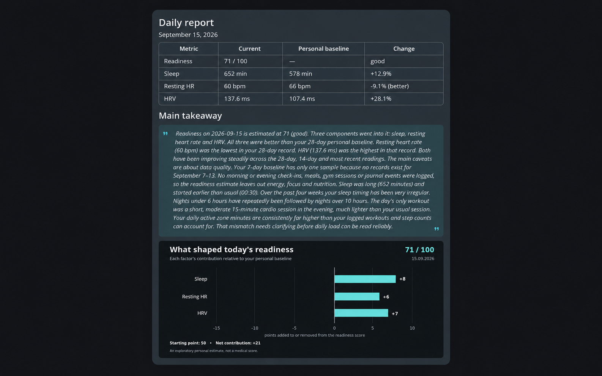
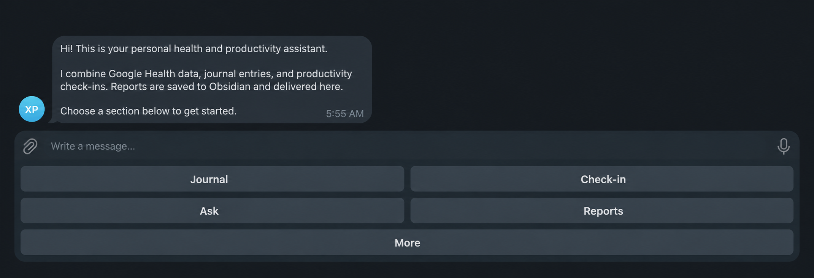
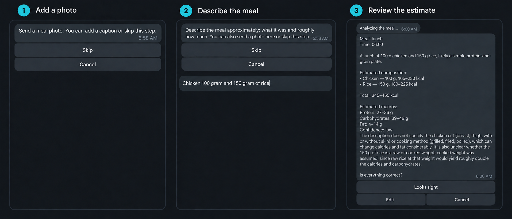
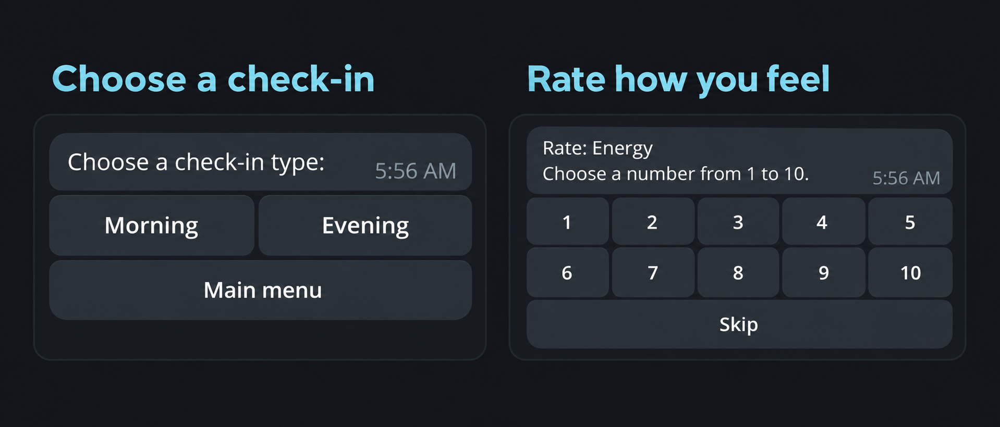
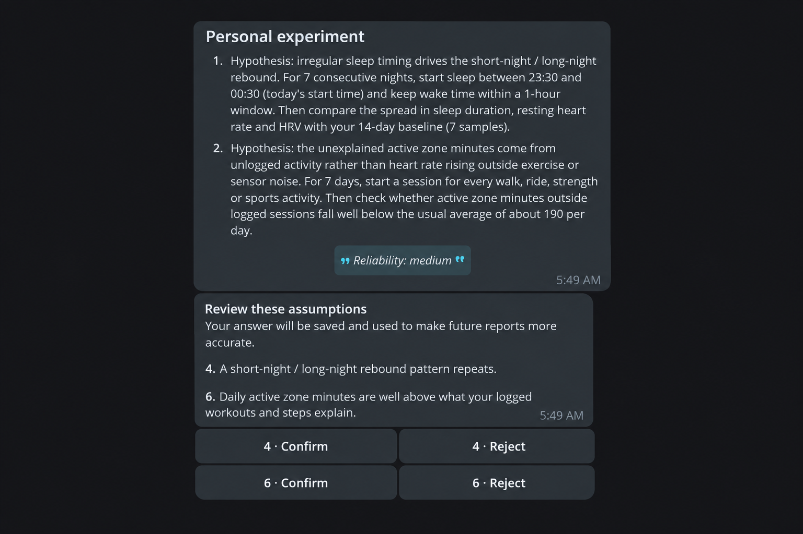

# OwnVitals for Fitbit & Pixel Watch

> Self-hosted health reports. Your data. Your baseline. Your insights.

OwnVitals is a self-hosted health reporting and personal insight agent for
Fitbit and Pixel Watch users. It combines wearable data from the Google Health
API with journal entries, nutrition, training, and productivity check-ins,
then creates personal reports through Claude.

The application runs on your own computer. Its primary interface is a private
Telegram chat; reports can also be written to an Obsidian vault.

> [!WARNING]
> OwnVitals is a single-user public beta. It is not a medical device and does
> not provide diagnosis, treatment, or emergency guidance.



## What it does

- Synchronizes sleep, activity, heart, body, and workout data from Google
  Health.
- Builds rolling 7-, 14-, and 28-day personal baselines instead of relying
  only on population averages.
- Records journal events, morning/evening check-ins, meal times, food photos,
  descriptions, optional exact nutrition values, and free-form training notes
  through Telegram.
- Imports nutrition from a linked FatSecret account or a FatSecret diary PDF.
- Generates daily, weekly, and monthly reports through the locally
  authenticated Claude CLI.
- Exports Markdown reports to a local folder or Obsidian vault and sends a
  readable summary with charts to Telegram.
- Supports English and Russian with `APP_LOCALE=en` or `APP_LOCALE=ru`.
- Stores application data locally in SQLite and creates local ZIP backups.

## Product tour

OwnVitals is operated from one private Telegram chat. The persistent menu
keeps journaling, check-ins, questions, and reports accessible without
memorizing commands.



Food can be recorded from a photo, an approximate description, optional exact
nutrition values, or any combination of them. OwnVitals presents the estimate
for confirmation before saving it.



Short morning and evening check-ins add subjective context such as energy,
focus, mood, stress, and work quality to the wearable measurements.



Reports separate facts from tentative associations. Confirming or rejecting
an uncertain finding creates a feedback loop that improves later reports.



All screenshots above use synthetic demonstration data.

## Beta support matrix

| Component | Supported configuration |
| --- | --- |
| Devices | Fitbit and Pixel Watch data available through Google Health |
| Operating system | Windows 11; Linux is best-effort and tested in CI |
| Python | 3.12 only |
| User interface | One private Telegram chat |
| LLM runtime | Claude CLI |
| Storage | Local SQLite and files |
| Languages | English and Russian |

Multi-user deployments, hosted service operation, Docker, other wearable
providers, and medical use are outside the beta scope. See
[the complete release scope](docs/release-scope.md).

## How data flows

```text
Fitbit / Pixel Watch
        |
        v
Google Health API ---> SQLite + local raw data
                              ^
Telegram journal ------------|
FatSecret -------------------|
                              |
                              v
                         Claude CLI
                              |
                    +---------+---------+
                    v                   v
                 Telegram        Markdown / Obsidian
```

OwnVitals has no hosted backend, analytics, or advertising SDK. Google,
Telegram, Anthropic, and optional FatSecret or sync services still receive the
data required for the features you enable. Read [PRIVACY.md](PRIVACY.md) before
installing.

## Prerequisites

- Git.
- Python 3.12. The project deliberately rejects Python 3.13 and newer during
  the beta.
- A Telegram bot token and your private chat ID.
- A Google Cloud project with the Google Health API enabled and an OAuth client
  credentials JSON file.
- The Claude CLI installed, authenticated, and available as `claude` on
  `PATH`.
- A Google account whose Fitbit or Pixel Watch data is available through
  Google Health.

Useful upstream instructions:

- [Google Health API setup](https://developers.google.com/health/setup)
- [Google Health data access and OAuth](https://developers.google.com/health/migration/data-access)
- [Create a Telegram bot with BotFather](https://core.telegram.org/bots/tutorial)
- [Install and authenticate the Claude CLI](https://docs.anthropic.com/en/docs/claude-code/getting-started)

## Install on Windows 11

Clone the repository, open PowerShell in its directory, and create an isolated
Python 3.12 environment:

```powershell
py -3.12 --version
py -3.12 -m venv .venv
.\.venv\Scripts\python.exe -m pip install --upgrade pip
.\.venv\Scripts\python.exe -m pip install -e .
Copy-Item .env.example .env
```

If `py -3.12` is unavailable, install a Python 3.12 release first. Do not
remove another Python version that is required by your operating system or
other projects.

Linux uses the equivalent commands:

```bash
python3.12 -m venv .venv
.venv/bin/python -m pip install --upgrade pip
.venv/bin/python -m pip install -e .
cp .env.example .env
```

## Configure the integrations

### 1. Telegram

Create a bot with BotFather and put its token in `TELEGRAM_BOT_TOKEN`. Send the
new bot a message, call Telegram's `getUpdates` endpoint, and copy the numeric
private chat ID into `TELEGRAM_ALLOWED_CHAT_ID`. Keep the token private: anyone
who has it controls the bot.

OwnVitals intentionally accepts commands only from this one configured chat.
Do not add the bot to a group.

### 2. Google Health

In Google Cloud:

1. Create or select a project and enable the Google Health API.
2. Configure the OAuth consent screen. While the application is in testing,
   add your Google account as a test user.
3. Add only the read-only Google Health scopes you need. The default OwnVitals
   configuration requests activity and fitness, health measurements, sleep,
   and profile access.
4. Create an OAuth client suitable for a local loopback authorization flow,
   download the credentials JSON, and save it as
   `data/google-client-secret.json`.

The credentials file and the refresh token created later are ignored by Git.
Never commit either file.

### 3. Claude CLI

Install and authenticate the Claude CLI using Anthropic's instructions, then
verify it from the same shell and operating-system account that will run
OwnVitals:

```text
claude --version
```

OwnVitals invokes `claude -p` as a subprocess. Your prompts and selected health
data are therefore processed according to the Anthropic account and runtime
you configured.

### 4. Environment file

Open `.env` and replace the placeholder values. At minimum, review:

```env
APP_LOCALE=en
TELEGRAM_BOT_TOKEN=replace-with-telegram-bot-token
TELEGRAM_ALLOWED_CHAT_ID=replace-with-your-chat-id
TIMEZONE=Europe/Kiev
OBSIDIAN_VAULT=C:\\Path\\To\\ObsidianVault
```

`APP_LOCALE` accepts `en` and `ru`. `TIMEZONE` must be an IANA time-zone name.
`OBSIDIAN_VAULT` can point to an actual Obsidian vault or any private local
directory. The remaining documented defaults are in [.env.example](.env.example).

FatSecret is optional. Leave `FATSECRET_CONSUMER_KEY` and
`FATSECRET_CONSUMER_SECRET` empty unless you want automatic diary import.

## First run

Initialize the database:

```powershell
.\.venv\Scripts\python.exe -m fitbit_report.cli init-db
```

Complete the one-time Google authorization. A browser window opens and the
resulting refresh token is stored locally:

```powershell
.\.venv\Scripts\python.exe -m fitbit_report.cli google-health-auth
```

Check the resolved configuration and synchronize one day:

```powershell
.\.venv\Scripts\python.exe -m fitbit_report.cli status
.\.venv\Scripts\python.exe -m fitbit_report.cli sync
```

Optionally load up to 90 completed days so the first personal baseline is more
useful:

```powershell
.\.venv\Scripts\python.exe -m fitbit_report.cli google-health-backfill --days 90
```

Run the complete Google Health to Claude to Obsidian to Telegram smoke test:

```powershell
.\.venv\Scripts\python.exe -m fitbit_report.cli test-report
```

Finally, start the long-running bot and scheduler:

```powershell
.\.venv\Scripts\python.exe run.py
```

Send `/start` to the bot. Keep exactly one OwnVitals process running. The
process handles Telegram long polling, regular synchronization, scheduled
reports, optional FatSecret import, and local backups.

For unattended Windows startup, follow the
[Task Scheduler guide](docs/windows-task-scheduler.md).

On Linux, replace `.\.venv\Scripts\python.exe` with `.venv/bin/python` in the
commands above.

## Synthetic data for screenshots

Never use a copy of your real OwnVitals database in public screenshots. The
project can create a deterministic demo database with 35 days of fictional
health, nutrition, journal, training, and productivity data:

```powershell
.\.venv\Scripts\python.exe -m fitbit_report.cli create-demo-db `
  --output data\ownvitals-demo.db --date 2026-09-15
```

Point a temporary `.env` at it with
`DATABASE_URL=sqlite:///data/ownvitals-demo.db`, then generate and send the
demo report without contacting Google Health:

```powershell
.\.venv\Scripts\python.exe -m fitbit_report.cli test-report `
  --date 2026-09-15 --no-sync
```

This second command still uses the configured Claude CLI and Telegram bot.
The generated database is under `data/`, so Git ignores it. Use `--force` to
recreate it with the same values. On Linux, replace the Python executable as
described above and use forward slashes in the output path.

## Telegram workflows

The persistent menu provides journal entry, productivity check-in, report
archive, synchronization, questions, usage, status, and help workflows.
Commands such as `/log`, `/checkin`, `/sync`, `/status`, `/usage`, `/mealtime`,
`/ask`, and `/training` are also available.

Reports are generated by the scheduler. A report can contain hypotheses and
recommendations tied to the underlying observations. Feedback buttons let you
confirm or reject individual findings; confirmed findings become personal
facts used by later reports.

The **Add food** flow accepts a photo, an approximate description, and exact
values such as calories or macros. Every step is optional, photo and text can
be combined in either order, and the result stays pending until confirmation.
Explicit calorie and macro values override model estimates. FatSecret data is
imported separately by the scheduled integration. Imported PDFs are parsed
locally, but a PDF sent through the bot first passes through Telegram.

## Operations and backups

- Runtime logs are written under `logs/`.
- SQLite, Google Health raw responses, OAuth tokens, photos, imported reports,
  and ZIP backups are written under `data/` by default.
- Generated Markdown reports are written under `OBSIDIAN_VAULT`.
- These paths are excluded from Git, but local backups are not encrypted.
- Re-run `init-db` after updating OwnVitals; it safely creates missing tables
  and columns used by the current release.

Create a backup manually with:

```powershell
.\.venv\Scripts\python.exe -m fitbit_report.cli backup
```

## Troubleshooting

**`requires a different Python` during installation**

Confirm that the virtual environment was created by Python 3.12:
`.\.venv\Scripts\python.exe --version`. Delete and recreate only `.venv` if it
uses another version.

**Google says access is blocked or the user is not allowed**

Confirm that the Google Health API is enabled, the requested scopes are on the
OAuth consent screen, and your account is listed as a test user. If a saved
grant was revoked, run `google-health-auth` again.

**The bot does not answer**

Check that only one process uses the bot token, the token is current, and
`TELEGRAM_ALLOWED_CHAT_ID` exactly matches the private chat. Review the newest
file in `logs/`; do not paste logs publicly without removing personal data.

**Claude generation fails**

Run `claude --version` and a simple `claude -p` request as the same OS user.
Re-authenticate Claude if necessary and verify that the model names in `.env`
are available to your account.

**Charts are missing**

Reinstall the project dependencies inside `.venv` and check the log for
`report charts skipped`.

## Updating

Stop the running process, fetch the new release, then update the environment
and database before restarting:

```powershell
git pull
.\.venv\Scripts\python.exe -m pip install -e .
.\.venv\Scripts\python.exe -m fitbit_report.cli init-db
```

Back up `data/` and your report directory before an update.

## Removing OwnVitals and its data

1. Stop the OwnVitals process.
2. Revoke OwnVitals access in your Google account and, if enabled, disconnect
   FatSecret.
3. Revoke the Telegram bot token with BotFather or delete the bot.
4. Delete `data/`, `logs/`, `.env`, the configured report directory, and any
   off-device backups you control.
5. Review and separately delete copies in Telegram, Obsidian Sync, file-sync
   providers, or provider account history.
6. Delete the cloned repository and its `.venv` if you no longer need the code.

Deleting the repository alone does not remove data stored in configured paths
outside it, or copies already handled by third-party services.

## Development

```powershell
py -3.12 -m venv .venv
.\.venv\Scripts\python.exe -m pip install -e ".[dev]"
.\.venv\Scripts\python.exe -m ruff check .
.\.venv\Scripts\python.exe -m pytest -q
.\.venv\Scripts\python.exe -m build
```

Read [CONTRIBUTING.md](CONTRIBUTING.md) before opening a change. Tests, issue
reports, screenshots, and examples must use synthetic data.
The current release gates are tracked in
[docs/release-checklist.md](docs/release-checklist.md). Checks that require real
Google Health, Claude, Telegram, or private data are isolated in the
[manual release-candidate test plan](docs/manual-rc-test-plan.md) and should be
run on the private test installation, not on a development-only computer.

## Security and privacy

This project handles sensitive health information. Read [SECURITY.md](SECURITY.md)
and [PRIVACY.md](PRIVACY.md), use a private OS account, and never publish your
`.env`, OAuth files, database, logs, photos, reports, or backups.

OwnVitals is not affiliated with or endorsed by Google, Fitbit, Anthropic,
Telegram, FatSecret, or Obsidian. Product names are trademarks of their
respective owners.

## License

OwnVitals is available under the [MIT License](LICENSE).
